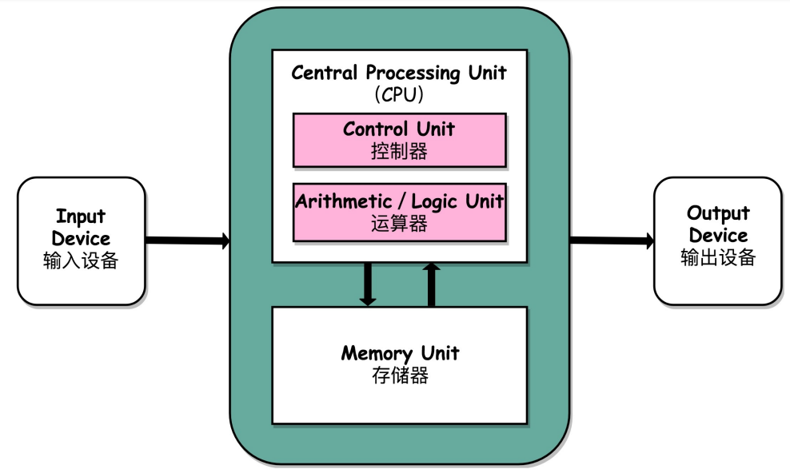

# 冯诺依曼体系结构

## 计算机的基本硬件组成

* 早年，自己组装一台计算机，你需要有三大件：CPU，内存，主板

1. 主板是一个有着许多插槽的配件。CPU和内存都需要插在主板上，主板的芯片组和总线解决了CPU和内存之间如何通信的问题。芯片组控制数据的流转，总线是数据的传输介质，因此，总线速度决定了数据能传输多快。

* 有了三大件，只要配上电源供电，计算机差不多就可以跑起来了，但是现在还缺少各类输入输出设备，也就是常说的I/O设备。

* 最后，你自己配的个人计算机，还需要配上一个硬盘，这样数据才能持久的保存下来。

* 还有一个特殊设备，显卡。显卡中包含了GPU，可以进行各种图形处理工作。

## 冯诺依曼体系结构

* 冯诺依曼体系结构也称作存储程序计算机。什么是存储程序计算机呢？它暗含了两个概念，一个是可编程，一个是存储。

* 一台冯诺依曼计算机包含什么呢？

1. 一个包含算术逻辑单元ALU，处理器寄存器的处理器单元，用来完成各种算术和逻辑运算。

2. 一个包含指令寄存器和程序计数器的控制器单元，用来控制程序的流程，通常就是不同条件下的分支和跳转。
> 上面的算术逻辑单元和控制器单元共同组成了CPU

3. 存储数据和指令的内存，以及更大容量的外存。

4. 各种I/O设备

## 总结

* 冯诺依曼体系结构确立了我们现在每天使用的计算机硬件架构。因此，学习计算机组成原理就是学习和拆解冯诺依曼体系结构。
